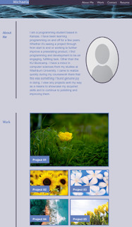

# challenge-2

## Description

As a programming student focusing on web development, I want to be able to create a portfolio that not only provides links to other projects, but in itself is a functional project for potential employers to see. I want the site to have functionality and be responsive, but also visually appealing so as to gain attention to my work by potential employers. In creating this portfolio, I have used CSS in order to style every element on the site. 

## Installation

N/A

## Usage
My portfolio can be accessed at https://michaelarb.github.io/challenge-2. 

The portfolio, as viewed on a desktop computer:
   

The portfolio, as viewed on a smartphone:
   
    
## Credits

N/A

## License

N/A